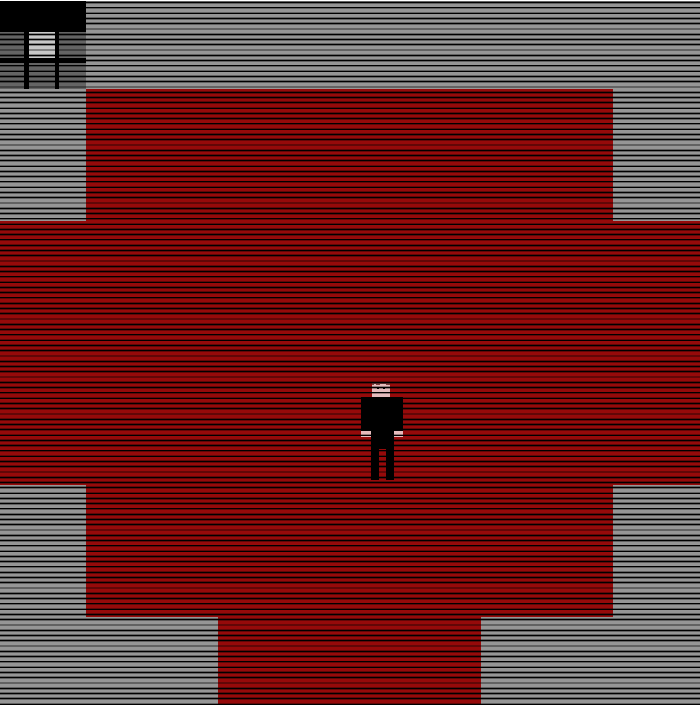
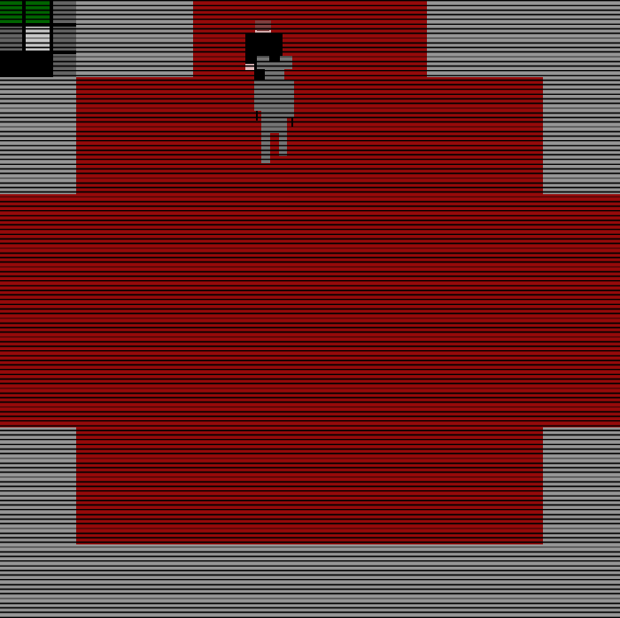
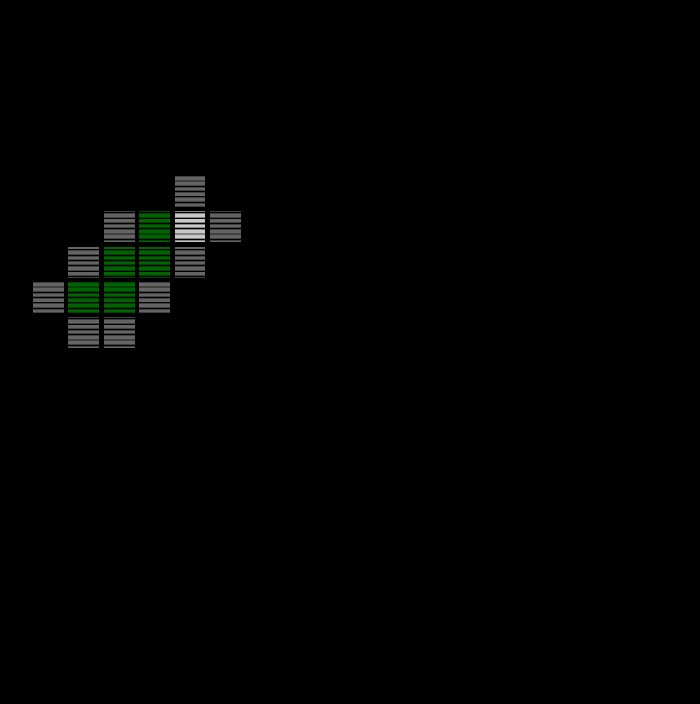

# SpookyManor

## Technologies used
- C++
- SFML

## Description
Spooky Manor is a 2D top down game where you have to find the exit of a proceduraly generated maze. The player will also have to avoid monsters that will appear from time to time.

The monsters are all unique, and some have specific ways to get past them, for instance :
- Some will simply attack the player
- Other will attack the player if he moves

## Screenshots

## Links
<a href="https://helisoya.itch.io/spooky-manor">Itch.io page</a>
